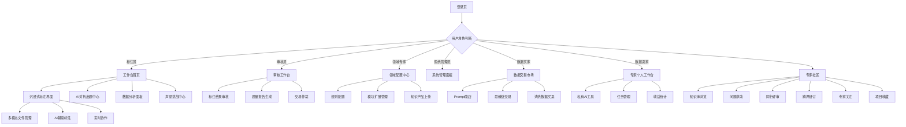

## 1. 产品概述
AI Native数据标注平台（职业模拟器）是一个模块化、可扩展的专业领域数据标注工作台。首期聚焦金融与法律领域，通过沉浸式工作流和AI对抗出题机制，为专业数据标注人员提供高效、准确的多模态数据标注环境。

平台采用模块化架构设计，支持后续无缝扩展至医疗、数学、工程等垂直领域，为各行业AI模型训练提供高质量的专业数据标注服务。同时引入数据交易市场和专家工作台，实现知识双向流动，打造专家与用户双赢的生态系统。

## 2. 核心功能

### 2.1 用户角色
| 角色 | 注册方式 | 核心权限 |
|------|----------|----------|
| 标注员 | 邮箱注册+专业认证 | 访问工作台、提交标注、查看个人统计、参与数据交易 |
| 审核员 | 管理员邀请+资质审核 | 审核标注结果、质量把控、生成报告、交易仲裁 |
| 领域专家 | 邀请制+专业认证 | 配置标注规则、AI对抗策略、领域扩展、出售专业知识、使用专家工作台 |
| 系统管理员 | 内部创建 | 用户管理、系统配置、数据分析、交易监管 |
| 数据买家 | 邮箱注册+实名认证 | 浏览购买数据、发布需求、评价交易 |
| 数据卖家 | 专家认证+信誉审核 | 出售Prompt、思维链、清洗数据、设置价格 |

### 2.2 功能模块
平台包含以下核心页面：
1. **工作台首页**：项目概览、任务分配、进度统计、声望系统
2. **沉浸式标注界面**：多模态文件管理、AI辅助标注、实时协作
3. **AI对抗出题中心**：智能题目生成、难度自适应、质量控制、挑战模式
4. **领域配置中心**：金融法律规则配置、扩展模块管理
5. **数据分析面板**：标注质量分析、效率统计、领域对比
6. **数据交易市场**：Prompt商店、思维链交易、清洗数据买卖
7. **专家个人工作台**：私有AI工具、任务管理、收益统计
8. **声望挑战中心**：排行榜、成就系统、技能认证
9. **专家社区（Knowledge Hub）**：知识库协作、跨领域交流、同行评审

### 2.3 页面详情
| 页面名称 | 模块名称 | 功能描述 |
|----------|----------|----------|
| 工作台首页 | 项目概览 | 显示当前标注项目列表、完成进度、质量评分 |
| 工作台首页 | 任务分配 | 基于专业能力和工作负载智能分配标注任务 |
| 工作台首页 | 进度统计 | 实时展示个人和团队标注效率、准确率等关键指标 |
| 工作台首页 | 声望系统 | 显示用户声望等级、经验值、成就徽章 |
| 沉浸式标注界面 | 多模态文件管理 | 支持文档、图片、音频、视频等多种格式文件上传预览 |
| 沉浸式标注界面 | AI辅助标注 | 智能识别关键信息、自动预标注、实时建议修正 |
| 沉浸式标注界面 | 实时协作 | 多人同步标注、冲突检测、版本控制 |
| AI对抗出题中心 | 智能题目生成 | 基于领域知识图谱自动生成标注题目 |
| AI对抗出题中心 | 难度自适应 | 根据标注员表现动态调整题目难度 |
| AI对抗出题中心 | 质量控制 | 多轮验证机制、专家审核、异常检测 |
| AI对抗出题中心 | 挑战模式 | 限时挑战、准确率挑战、连击奖励机制 |
| 领域配置中心 | 金融法律规则 | 配置专业术语库、标注规范、质量标准 |
| 领域配置中心 | 扩展模块管理 | 管理医疗、数学、工程等扩展模块的启用和配置 |
| 数据分析面板 | 质量分析 | 标注准确率、一致性分析、错误类型统计 |
| 数据分析面板 | 效率统计 | 标注速度、任务完成时间、工作效率趋势 |
| 数据分析面板 | 领域对比 | 不同专业领域的标注质量和效率对比分析 |
| 数据交易市场 | Prompt商店 | 专家出售高质量Prompt模板，支持试用和购买 |
| 数据交易市场 | 思维链交易 | 专家出售问题推理过程，包含详细思考步骤 |
| 数据交易市场 | 清洗数据买卖 | 交易经过清洗的专业数据集，支持预览和验证 |
| 数据交易市场 | 需求发布 | 买家发布数据需求，专家接单完成定制服务 |
| 数据交易市场 | 交易仲裁 | 处理交易纠纷，保障买卖双方权益 |
| 专家个人工作台 | 私有AI工具 | 专家使用平台AI能力处理私有工作任务 |
| 专家个人工作台 | 任务管理 | 管理个人数据交易订单和私有任务 |
| 专家个人工作台 | 收益统计 | 查看知识变现收入，支持提现和转账 |
| 声望挑战中心 | 排行榜 | 展示各领域专家声望排名和标注员表现 |
| 声望挑战中心 | 成就系统 | 完成特定任务获得徽章和称号 |
| 声望挑战中心 | 技能认证 | 通过专业考试获得技能认证徽章 |
| 声望挑战中心 | 挑战模式 | 参与高难度标注挑战，获得额外声望奖励 |
| 专家社区（Knowledge Hub） | 知识库（Repositories） | 创建和管理各领域知识资产，支持版本控制 |
| 专家社区（Knowledge Hub） | 问题求助（Issues） | 发布专业难题，设置悬赏，邀请专家解答 |
| 专家社区（Knowledge Hub） | 同行评审（Pull Requests） | 提交知识修订建议，进行专业同行评议 |
| 专家社区（Knowledge Hub） | 跨界研讨（Discussions） | 跨领域专家讨论区，促进知识交叉融合 |
| 专家社区（Knowledge Hub） | 专家关注 | 关注领域专家，获取最新动态和知识分享 |
| 专家社区（Knowledge Hub） | 项目收藏（Star） | 收藏有价值的知识库，建立个人知识收藏 |
| 专家社区（Knowledge Hub） | 知识复刻（Fork） | 复刻他人知识库进行二次开发和改进 |
| 专家社区（Knowledge Hub） | 领域分类 | 法律、文学、医疗、数理、代码等专业领域分类 |
| 专家社区（Knowledge Hub） | 知识搜索 | 全文检索和语义搜索，快速定位相关知识 |
| 专家社区（Knowledge Hub） | 动态流 | 实时展示关注专家和项目的最新活动 |

## 3. 核心流程

### 标注员工作流程
1. 登录系统后进入工作台首页，查看分配到的标注任务
2. 选择任务进入沉浸式标注界面，加载多模态数据文件
3. 使用AI辅助功能进行预标注，根据专业判断进行修正
4. 提交标注结果，系统自动进行初步质量检查
5. 查看个人统计数据，了解标注质量和效率表现
6. 参与声望挑战，提升等级和获得成就

### 审核员工作流程
1. 登录后进入审核工作台，查看待审核的标注结果
2. 对标注结果进行专业审核，标记需要修正的内容
3. 生成质量审核报告，反馈给标注员进行改进
4. 统计分析整体标注质量，提出优化建议
5. 处理数据交易纠纷，保障平台交易公平

### 领域专家工作流程
1. 配置专业领域的标注规则和质量标准
2. 设计AI对抗出题策略，确保题目难度和专业性
3. 审核扩展模块的配置，确保新领域的专业性要求
4. 分析跨领域数据，优化整体标注流程
5. 在数据交易市场出售专业知识和经验
6. 使用专家工作台处理私有工作任务，提升工作效率
7. 参与声望挑战，提升专业影响力和收益

### 数据买家流程
1. 浏览数据交易市场，搜索需要的专业数据
2. 预览数据样本，评估数据质量和适用性
3. 下单购买数据，支持多种支付方式
4. 下载数据并使用，对交易进行评价

### 数据卖家流程
1. 上传专业知识产品（Prompt、思维链、清洗数据）
2. 设置合理价格和描述，提供数据预览
3. 处理买家订单，及时交付数据产品
4. 管理收益提现，维护卖家信誉评级

### 专家社区使用流程
1. 浏览各领域知识库，搜索感兴趣的专业内容
2. 关注领域专家，收藏有价值的知识项目
3. 发布专业难题求助，设置悬赏吸引解答
4. 参与同行评审，对知识修订提出建议
5. 在跨界研讨区参与跨领域讨论，分享见解
6. 创建个人知识库，分享专业经验和资产
7. 复刻他人知识库进行改进，形成知识迭代

## 4. 用户界面设计

### 4.1 设计风格
- **主色调**：Google Lab白 (#FFFFFF) + 实验蓝 (#4285F4)
- **辅助色**：创新绿 (#34A853)、智能黄 (#FBBC04)、探索红 (#EA4335)
- **按钮风格**：极简圆角设计，3D悬浮效果，主要操作使用纯色背景
- **字体选择**：Google Sans + Roboto，标题 18-22px，正文 13-15px
- **布局风格**：顶部导航 + 卡片式实验台布局，强调留白和呼吸感
- **图标风格**：Material Design 圆润图标，统一使用 Google 图标库
- **动效风格**：微妙的物理动效，强调实验感和探索感
- **实验元素**：试管、烧杯、分子结构等科学实验图标点缀

### 4.2 页面设计概览
| 页面名称 | 模块名称 | UI元素 |
|----------|----------|--------|
| 工作台首页 | 项目概览 | 卡片式项目展示，进度环形图，质量评分星级显示 |
| 工作台首页 | 任务分配 | 表格形式展示任务列表，优先级标签，状态指示器 |
| 工作台首页 | 声望系统 | 经验值条，等级图标，声望粒子特效 |
| 沉浸式标注界面 | 多模态文件管理 | 左侧文件树结构，中央预览区域，右侧标注面板 |
| 沉浸式标注界面 | AI辅助标注 | 半透明悬浮建议框，一键应用按钮，置信度显示 |
| AI对抗出题中心 | 智能题目生成 | 流程图形式展示题目生成过程，实时难度调整滑块 |
| AI对抗出题中心 | 挑战模式 | 倒计时器，进度条，连击计数器，粒子特效 |
| 数据分析面板 | 质量分析 | 折线图展示准确率趋势，柱状图对比不同维度 |
| 数据交易市场 | Prompt商店 | 卡片式产品展示，价格标签，试用按钮，评分星级 |
| 数据交易市场 | 思维链交易 | 步骤化展示思维过程，支持预览和交互式体验 |
| 专家个人工作台 | 私有AI工具 | 实验台风格工具面板，试管图标，化学反应动画 |
| 声望挑战中心 | 排行榜 | 奖杯图标，等级徽章，进度条，粒子特效 |
| 声望挑战中心 | 成就系统 | 解锁动画，徽章收集，成就墙展示 |
| 专家社区（Knowledge Hub） | 知识库展示 | 卡片式知识库列表，领域标签，星级评分，复刻数统计 |
| 专家社区（Knowledge Hub） | 问题求助区 | 论坛式布局，悬赏金额标签，解答状态指示，专家头像 |
| 专家社区（Knowledge Hub） | 同行评审 | 差异对比视图，评审意见列表，专业评分系统 |
| 专家社区（Knowledge Hub） | 跨界研讨 | 话题标签云，领域交叉可视化，热门讨论排行 |
| 专家社区（Knowledge Hub） | 专家档案 | 专业认证徽章，贡献统计，知识领域图谱 |
| 专家社区（Knowledge Hub） | 动态流 | 时间轴布局，活动类型图标，实时更新提示 |

### 4.3 响应式设计
- **桌面优先**：主要面向专业用户，优先优化桌面端体验
- **移动端适配**：支持平板设备的基本操作，手机端仅查看统计
- **触控优化**：标注界面支持触控笔操作，适合专业标注场景
- **实验台适配**：专家工作台支持多窗口布局，类似实验室工作站

### 4.4 游戏化元素设计
- **声望系统**：经验值获取、等级提升、称号解锁
- **挑战模式**：限时任务、准确率挑战、连击奖励
- **成就徽章**：专业认证、完美标注、知识分享、交易达人
- **排行榜**：日榜、周榜、月榜，支持领域细分排名
- **粒子特效**：完成任务时的庆祝动画，升级时的光环效果
- **进度可视化**：环形进度条、阶梯式等级显示、里程碑标记