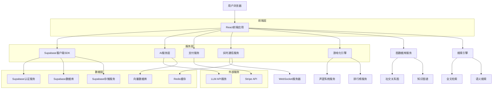
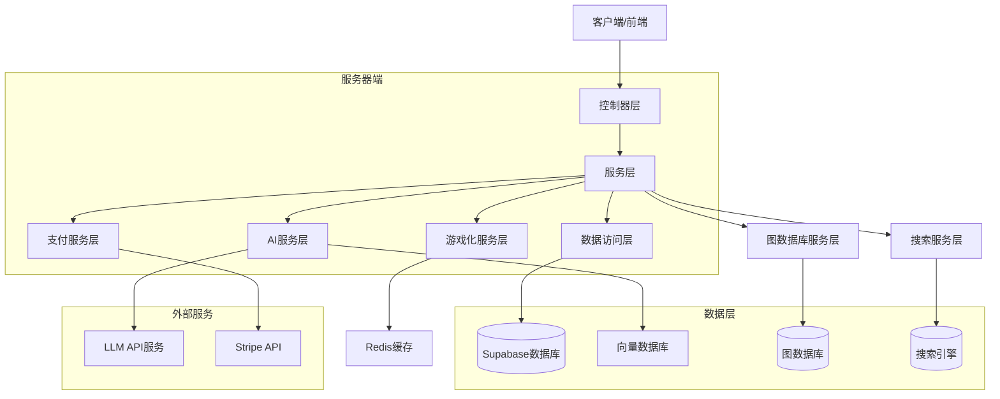
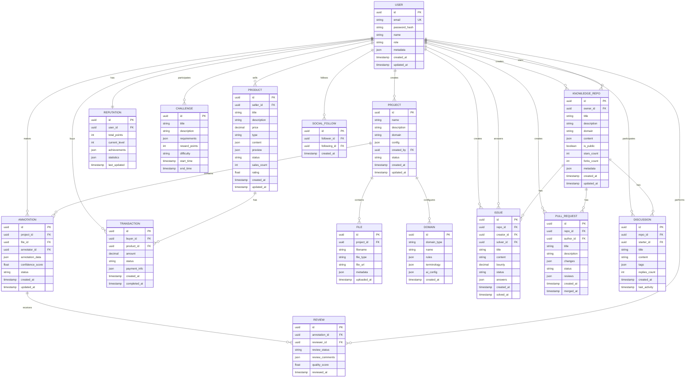

## 1. 架构设计



## 2. 技术描述

- **前端**: React@18 + TypeScript + TailwindCSS@3 + Vite
- **初始化工具**: vite-init
- **后端**: Supabase (BaaS)
- **AI服务**: Python FastAPI + OpenAI/Anthropic API
- **向量数据库**: Pinecone/Qdrant (用于知识图谱和语义搜索)
- **文件处理**: Python + Apache Tika + OpenCV + Librosa
- **支付系统**: Stripe API (用于数据交易支付)
- **实时通信**: WebSocket + Redis (用于实时协作和通知)
- **图数据库**: Neo4j/ArangoDB (社交关系、知识图谱)
- **搜索引擎**: Elasticsearch (全文检索、语义搜索)
- **游戏化引擎**: Node.js + Redis (声望系统、排行榜)

### 核心依赖包
```json
{
  "dependencies": {
    "react": "^18.2.0",
    "react-router-dom": "^6.8.0",
    "@supabase/supabase-js": "^2.8.0",
    "@heroicons/react": "^2.0.0",
    "recharts": "^2.5.0",
    "react-dropzone": "^14.2.0",
    "react-pdf": "^6.2.0",
    "fabric": "^5.3.0",
    "socket.io-client": "^4.6.0",
    "framer-motion": "^10.0.0",
    "react-confetti": "^6.1.0",
    "@stripe/stripe-js": "^1.48.0",
    "react-hot-toast": "^2.4.0"
  },
  "devDependencies": {
    "@types/react": "^18.0.0",
    "@vitejs/plugin-react": "^3.1.0",
    "tailwindcss": "^3.2.0",
    "typescript": "^4.9.0",
    "vite": "^4.1.0"
  }
}
```

## 3. 路由定义

| 路由 | 用途 |
|-------|---------|
| / | 登录页，用户认证入口 |
| /dashboard | 工作台首页，项目概览和任务分配 |
| /annotate/:projectId | 沉浸式标注界面，具体标注工作区 |
| /ai-challenge | AI对抗出题中心，智能题目生成 |
| /domain-config | 领域配置中心，专业规则管理 |
| /analytics | 数据分析面板，统计和报告 |
| /review | 审核工作台，标注结果审核 |
| /admin | 系统管理面板，用户和权限管理 |
| /marketplace | 数据交易市场，Prompt和思维链交易 |
| /expert-workbench | 专家个人工作台，私有AI工具 |
| /reputation | 声望挑战中心，排行榜和成就系统 |
| /profile/:userId | 个人主页，展示成就和交易记录 |
| /knowledge-hub | 专家社区首页，知识库浏览和发现 |
| /knowledge-hub/repo/:repoId | 知识库详情页，展示知识资产内容 |
| /knowledge-hub/issues | 问题求助区，发布和解答专业难题 |
| /knowledge-hub/discussions | 跨界研讨区，跨领域讨论交流 |
| /knowledge-hub/search | 知识搜索页，全文和语义搜索 |
| /knowledge-hub/experts | 专家名录，各领域专家展示 |
| /knowledge-hub/activity | 动态流，关注专家和项目动态 |

## 4. API定义

### 4.1 认证相关API

```
POST /api/auth/login
```

请求参数：
| 参数名 | 参数类型 | 是否必需 | 描述 |
|-----------|-------------|-------------|-------------|
| email | string | true | 用户邮箱地址 |
| password | string | true | 用户密码 |

响应参数：
| 参数名 | 参数类型 | 描述 |
|-----------|-------------|-------------|
| access_token | string | JWT访问令牌 |
| refresh_token | string | 刷新令牌 |
| user | object | 用户信息对象 |

### 4.2 标注项目API

```
GET /api/projects
```

响应参数：
| 参数名 | 参数类型 | 描述 |
|-----------|-------------|-------------|
| projects | array | 项目列表 |
| total_count | number | 项目总数 |

### 4.3 文件上传API

```
POST /api/files/upload
```

请求参数（FormData）：
| 参数名 | 参数类型 | 是否必需 | 描述 |
|-----------|-------------|-------------|-------------|
| file | File | true | 要上传的文件 |
| project_id | string | true | 所属项目ID |
| file_type | string | true | 文件类型 (document/image/audio/video) |

### 4.4 AI辅助标注API

```
POST /api/ai/assist
```

请求参数：
| 参数名 | 参数类型 | 是否必需 | 描述 |
|-----------|-------------|-------------|-------------|
| content | string | true | 需要标注的内容 |
| domain | string | true | 领域类型 (finance/law) |
| context | object | false | 上下文信息 |

### 4.5 数据交易API

```
POST /api/marketplace/products
```

请求参数：
| 参数名 | 参数类型 | 是否必需 | 描述 |
|-----------|-------------|-------------|-------------|
| title | string | true | 产品标题 |
| description | string | true | 产品描述 |
| price | number | true | 价格 (USD) |
| type | string | true | 产品类型 (prompt/thinking_chain/data) |
| content | object | true | 产品内容 |
| preview | object | false | 预览内容 |

```
POST /api/marketplace/purchase
```

请求参数：
| 参数名 | 参数类型 | 是否必需 | 描述 |
|-----------|-------------|-------------|-------------|
| product_id | string | true | 产品ID |
| payment_method | string | true | 支付方式 |

### 4.6 声望系统API

```
POST /api/reputation/earn
```

请求参数：
| 参数名 | 参数类型 | 是否必需 | 描述 |
|-----------|-------------|-------------|-------------|
| action | string | true | 动作类型 (annotation/challenge/transaction) |
| points | number | true | 获得声望点数 |
| metadata | object | false | 额外元数据 |

```
GET /api/reputation/leaderboard
```

响应参数：
| 参数名 | 参数类型 | 描述 |
|-----------|-------------|-------------|
| users | array | 排行榜用户列表 |
| rankings | object | 各维度排名数据 |

### 4.7 专家社区API

```
GET /api/knowledge/repos
```

请求参数：
| 参数名 | 参数类型 | 是否必需 | 描述 |
|-----------|-------------|-------------|-------------|
| domain | string | false | 领域筛选 |
| sort_by | string | false | 排序方式 (stars/forks/recent) |
| search | string | false | 搜索关键词 |

```
POST /api/knowledge/repos
```

请求参数：
| 参数名 | 参数类型 | 是否必需 | 描述 |
|-----------|-------------|-------------|-------------|
| title | string | true | 知识库标题 |
| description | string | true | 知识库描述 |
| domain | string | true | 所属领域 |
| content | object | true | 知识库内容 |
| is_public | boolean | true | 是否公开 |

```
POST /api/knowledge/issues
```

请求参数：
| 参数名 | 参数类型 | 是否必需 | 描述 |
|-----------|-------------|-------------|-------------|
| repo_id | string | true | 关联知识库ID |
| title | string | true | 问题标题 |
| content | string | true | 问题内容 |
| bounty | number | false | 悬赏金额 |
| domain | string | true | 所属领域 |

```
POST /api/knowledge/search
```

请求参数：
| 参数名 | 参数类型 | 是否必需 | 描述 |
|-----------|-------------|-------------|-------------|
| query | string | true | 搜索查询 |
| type | string | false | 搜索类型 (fulltext/semantic) |
| domains | array | false | 领域筛选 |

```
POST /api/social/follow
```

请求参数：
| 参数名 | 参数类型 | 是否必需 | 描述 |
|-----------|-------------|-------------|-------------|
| user_id | string | true | 要关注的用户ID |
| action | string | true | 操作类型 (follow/unfollow) |

```
POST /api/social/star
```

请求参数：
| 参数名 | 参数类型 | 是否必需 | 描述 |
|-----------|-------------|-------------|-------------|
| repo_id | string | true | 要收藏的知识库ID |
| action | string | true | 操作类型 (star/unstar) |

## 5. 服务器架构图



## 6. 数据模型

### 6.1 数据模型定义



### 6.2 数据定义语言

用户表 (users)
```sql
-- 创建表
CREATE TABLE users (
    id UUID PRIMARY KEY DEFAULT gen_random_uuid(),
    email VARCHAR(255) UNIQUE NOT NULL,
    password_hash VARCHAR(255) NOT NULL,
    name VARCHAR(100) NOT NULL,
    role VARCHAR(20) DEFAULT 'annotator' CHECK (role IN ('annotator', 'reviewer', 'expert', 'admin', 'buyer', 'seller')),
    metadata JSONB DEFAULT '{}',
    created_at TIMESTAMP WITH TIME ZONE DEFAULT NOW(),
    updated_at TIMESTAMP WITH TIME ZONE DEFAULT NOW()
);

-- 创建索引
CREATE INDEX idx_users_email ON users(email);
CREATE INDEX idx_users_role ON users(role);
```

项目表 (projects)
```sql
-- 创建表
CREATE TABLE projects (
    id UUID PRIMARY KEY DEFAULT gen_random_uuid(),
    name VARCHAR(200) NOT NULL,
    description TEXT,
    domain VARCHAR(50) NOT NULL,
    config JSONB DEFAULT '{}',
    created_by UUID REFERENCES users(id),
    status VARCHAR(20) DEFAULT 'active' CHECK (status IN ('active', 'paused', 'completed')),
    created_at TIMESTAMP WITH TIME ZONE DEFAULT NOW(),
    updated_at TIMESTAMP WITH TIME ZONE DEFAULT NOW()
);

-- 创建索引
CREATE INDEX idx_projects_domain ON projects(domain);
CREATE INDEX idx_projects_status ON projects(status);
CREATE INDEX idx_projects_created_by ON projects(created_by);
```

标注结果表 (annotations)
```sql
-- 创建表
CREATE TABLE annotations (
    id UUID PRIMARY KEY DEFAULT gen_random_uuid(),
    project_id UUID REFERENCES projects(id) ON DELETE CASCADE,
    file_id UUID REFERENCES files(id) ON DELETE CASCADE,
    annotator_id UUID REFERENCES users(id),
    annotation_data JSONB NOT NULL,
    confidence_score FLOAT DEFAULT 0.0,
    status VARCHAR(20) DEFAULT 'pending' CHECK (status IN ('pending', 'completed', 'rejected')),
    created_at TIMESTAMP WITH TIME ZONE DEFAULT NOW(),
    updated_at TIMESTAMP WITH TIME ZONE DEFAULT NOW()
);

-- 创建索引
CREATE INDEX idx_annotations_project_id ON annotations(project_id);
CREATE INDEX idx_annotations_annotator_id ON annotations(annotator_id);
CREATE INDEX idx_annotations_status ON annotations(status);
```

文件表 (files)
```sql
-- 创建表
CREATE TABLE files (
    id UUID PRIMARY KEY DEFAULT gen_random_uuid(),
    project_id UUID REFERENCES projects(id) ON DELETE CASCADE,
    filename VARCHAR(255) NOT NULL,
    file_type VARCHAR(50) NOT NULL,
    file_url TEXT NOT NULL,
    metadata JSONB DEFAULT '{}',
    uploaded_at TIMESTAMP WITH TIME ZONE DEFAULT NOW()
);

-- 创建索引
CREATE INDEX idx_files_project_id ON files(project_id);
CREATE INDEX idx_files_file_type ON files(file_type);
```

产品表 (products)
```sql
-- 创建表
CREATE TABLE products (
    id UUID PRIMARY KEY DEFAULT gen_random_uuid(),
    seller_id UUID REFERENCES users(id),
    title VARCHAR(200) NOT NULL,
    description TEXT,
    price DECIMAL(10,2) NOT NULL CHECK (price >= 0),
    type VARCHAR(20) CHECK (type IN ('prompt', 'thinking_chain', 'data')),
    content JSONB NOT NULL,
    preview JSONB DEFAULT '{}',
    status VARCHAR(20) DEFAULT 'active' CHECK (status IN ('active', 'inactive', 'sold_out')),
    sales_count INTEGER DEFAULT 0,
    rating FLOAT DEFAULT 0.0 CHECK (rating >= 0 AND rating <= 5),
    created_at TIMESTAMP WITH TIME ZONE DEFAULT NOW(),
    updated_at TIMESTAMP WITH TIME ZONE DEFAULT NOW()
);

-- 创建索引
CREATE INDEX idx_products_seller_id ON products(seller_id);
CREATE INDEX idx_products_type ON products(type);
CREATE INDEX idx_products_status ON products(status);
CREATE INDEX idx_products_price ON products(price);
```

交易表 (transactions)
```sql
-- 创建表
CREATE TABLE transactions (
    id UUID PRIMARY KEY DEFAULT gen_random_uuid(),
    buyer_id UUID REFERENCES users(id),
    product_id UUID REFERENCES products(id),
    amount DECIMAL(10,2) NOT NULL,
    status VARCHAR(20) DEFAULT 'pending' CHECK (status IN ('pending', 'completed', 'cancelled', 'disputed')),
    payment_info JSONB DEFAULT '{}',
    created_at TIMESTAMP WITH TIME ZONE DEFAULT NOW(),
    completed_at TIMESTAMP WITH TIME ZONE DEFAULT NOW()
);

-- 创建索引
CREATE INDEX idx_transactions_buyer_id ON transactions(buyer_id);
CREATE INDEX idx_transactions_product_id ON transactions(product_id);
CREATE INDEX idx_transactions_status ON transactions(status);
```

声望表 (reputation)
```sql
-- 创建表
CREATE TABLE reputation (
    id UUID PRIMARY KEY DEFAULT gen_random_uuid(),
    user_id UUID REFERENCES users(id) UNIQUE,
    total_points INTEGER DEFAULT 0,
    current_level INTEGER DEFAULT 1,
    achievements JSONB DEFAULT '[]',
    statistics JSONB DEFAULT '{}',
    last_updated TIMESTAMP WITH TIME ZONE DEFAULT NOW()
);

-- 创建索引
CREATE INDEX idx_reputation_user_id ON reputation(user_id);
CREATE INDEX idx_reputation_total_points ON reputation(total_points DESC);
CREATE INDEX idx_reputation_level ON reputation(current_level);
```

### 6.3 Supabase权限配置

```sql
-- 基础权限设置
GRANT SELECT ON users TO anon;
GRANT ALL PRIVILEGES ON users TO authenticated;

GRANT SELECT ON projects TO anon;
GRANT ALL PRIVILEGES ON projects TO authenticated;

GRANT SELECT ON files TO anon;
GRANT ALL PRIVILEGES ON files TO authenticated;

GRANT SELECT ON annotations TO anon;
GRANT ALL PRIVILEGES ON annotations TO authenticated;

-- RLS (Row Level Security) 策略
ALTER TABLE annotations ENABLE ROW LEVEL SECURITY;

-- 标注员只能查看和修改自己的标注
CREATE POLICY "annotators_can_edit_own_annotations" ON annotations
    FOR ALL TO authenticated
    USING (annotator_id = auth.uid());

-- 审核员可以查看所有标注
CREATE POLICY "reviewers_can_view_all_annotations" ON annotations
    FOR SELECT TO authenticated
    USING (EXISTS (
        SELECT 1 FROM users 
        WHERE users.id = auth.uid() 
        AND users.role = 'reviewer'
    ));

-- 数据交易市场权限
GRANT SELECT ON products TO anon;
GRANT ALL PRIVILEGES ON products TO authenticated;

GRANT SELECT ON transactions TO anon;
GRANT ALL PRIVILEGES ON transactions TO authenticated;

-- 声望系统权限
GRANT SELECT ON reputation TO anon;
GRANT ALL PRIVILEGES ON reputation TO authenticated;

-- 产品表 RLS 策略
ALTER TABLE products ENABLE ROW LEVEL SECURITY;

-- 用户可以查看所有活跃产品
CREATE POLICY "users_can_view_active_products" ON products
    FOR SELECT TO authenticated
    USING (status = 'active');

-- 卖家可以管理自己的产品
CREATE POLICY "sellers_can_manage_own_products" ON products
    FOR ALL TO authenticated
    USING (seller_id = auth.uid());

-- 交易表 RLS 策略
ALTER TABLE transactions ENABLE ROW LEVEL SECURITY;

-- 买家可以查看自己的交易
CREATE POLICY "buyers_can_view_own_transactions" ON transactions
    FOR SELECT TO authenticated
    USING (buyer_id = auth.uid());

-- 声望表 RLS 策略
ALTER TABLE reputation ENABLE ROW LEVEL SECURITY;

-- 用户可以查看所有声望信息
CREATE POLICY "users_can_view_reputation" ON reputation
    FOR SELECT TO authenticated
    USING (true);

-- 用户可以更新自己的声望
CREATE POLICY "users_can_update_own_reputation" ON reputation
    FOR UPDATE TO authenticated
    USING (user_id = auth.uid());

-- 知识库表 (knowledge_repos)
CREATE TABLE knowledge_repos (
    id UUID PRIMARY KEY DEFAULT gen_random_uuid(),
    owner_id UUID REFERENCES users(id),
    title VARCHAR(200) NOT NULL,
    description TEXT,
    domain VARCHAR(50) NOT NULL,
    content JSONB NOT NULL,
    is_public BOOLEAN DEFAULT true,
    stars_count INTEGER DEFAULT 0,
    forks_count INTEGER DEFAULT 0,
    metadata JSONB DEFAULT '{}',
    created_at TIMESTAMP WITH TIME ZONE DEFAULT NOW(),
    updated_at TIMESTAMP WITH TIME ZONE DEFAULT NOW()
);

-- 创建索引
CREATE INDEX idx_knowledge_repos_owner_id ON knowledge_repos(owner_id);
CREATE INDEX idx_knowledge_repos_domain ON knowledge_repos(domain);
CREATE INDEX idx_knowledge_repos_is_public ON knowledge_repos(is_public);
CREATE INDEX idx_knowledge_repos_stars_count ON knowledge_repos(stars_count DESC);

-- 问题求助表 (issues)
CREATE TABLE issues (
    id UUID PRIMARY KEY DEFAULT gen_random_uuid(),
    repo_id UUID REFERENCES knowledge_repos(id) ON DELETE CASCADE,
    creator_id UUID REFERENCES users(id),
    solver_id UUID REFERENCES users(id),
    title VARCHAR(200) NOT NULL,
    content TEXT NOT NULL,
    bounty DECIMAL(10,2) DEFAULT 0.00,
    status VARCHAR(20) DEFAULT 'open' CHECK (status IN ('open', 'solved', 'closed')),
    answers JSONB DEFAULT '[]',
    created_at TIMESTAMP WITH TIME ZONE DEFAULT NOW(),
    solved_at TIMESTAMP WITH TIME ZONE DEFAULT NULL
);

-- 创建索引
CREATE INDEX idx_issues_repo_id ON issues(repo_id);
CREATE INDEX idx_issues_creator_id ON issues(creator_id);
CREATE INDEX idx_issues_status ON issues(status);
CREATE INDEX idx_issues_bounty ON issues(bounty DESC);

-- 同行评审表 (pull_requests)
CREATE TABLE pull_requests (
    id UUID PRIMARY KEY DEFAULT gen_random_uuid(),
    repo_id UUID REFERENCES knowledge_repos(id) ON DELETE CASCADE,
    author_id UUID REFERENCES users(id),
    title VARCHAR(200) NOT NULL,
    description TEXT,
    changes JSONB NOT NULL,
    status VARCHAR(20) DEFAULT 'open' CHECK (status IN ('open', 'approved', 'rejected', 'merged')),
    reviews JSONB DEFAULT '[]',
    created_at TIMESTAMP WITH TIME ZONE DEFAULT NOW(),
    merged_at TIMESTAMP WITH TIME ZONE DEFAULT NULL
);

-- 创建索引
CREATE INDEX idx_pull_requests_repo_id ON pull_requests(repo_id);
CREATE INDEX idx_pull_requests_author_id ON pull_requests(author_id);
CREATE INDEX idx_pull_requests_status ON pull_requests(status);

-- 讨论表 (discussions)
CREATE TABLE discussions (
    id UUID PRIMARY KEY DEFAULT gen_random_uuid(),
    repo_id UUID REFERENCES knowledge_repos(id) ON DELETE CASCADE,
    starter_id UUID REFERENCES users(id),
    title VARCHAR(200) NOT NULL,
    content TEXT NOT NULL,
    tags JSONB DEFAULT '[]',
    replies_count INTEGER DEFAULT 0,
    created_at TIMESTAMP WITH TIME ZONE DEFAULT NOW(),
    last_activity TIMESTAMP WITH TIME ZONE DEFAULT NOW()
);

-- 创建索引
CREATE INDEX idx_discussions_repo_id ON discussions(repo_id);
CREATE INDEX idx_discussions_starter_id ON discussions(starter_id);
CREATE INDEX idx_discussions_last_activity ON discussions(last_activity DESC);

-- 社交关注表 (social_follows)
CREATE TABLE social_follows (
    id UUID PRIMARY KEY DEFAULT gen_random_uuid(),
    follower_id UUID REFERENCES users(id),
    following_id UUID REFERENCES users(id),
    created_at TIMESTAMP WITH TIME ZONE DEFAULT NOW(),
    UNIQUE(follower_id, following_id)
);

-- 创建索引
CREATE INDEX idx_social_follows_follower_id ON social_follows(follower_id);
CREATE INDEX idx_social_follows_following_id ON social_follows(following_id);

-- 知识库权限
GRANT SELECT ON knowledge_repos TO anon;
GRANT ALL PRIVILEGES ON knowledge_repos TO authenticated;

-- 知识库 RLS 策略
ALTER TABLE knowledge_repos ENABLE ROW LEVEL SECURITY;

-- 公开知识库可查看
CREATE POLICY "public_repos_can_be_viewed" ON knowledge_repos
    FOR SELECT TO authenticated
    USING (is_public = true);

-- 所有者可以管理自己的知识库
CREATE POLICY "owners_can_manage_own_repos" ON knowledge_repos
    FOR ALL TO authenticated
    USING (owner_id = auth.uid());

-- 问题求助权限
GRANT SELECT ON issues TO anon;
GRANT ALL PRIVILEGES ON issues TO authenticated;

-- 问题 RLS 策略
ALTER TABLE issues ENABLE ROW LEVEL SECURITY;

-- 公开知识库的问题可查看
CREATE POLICY "public_issues_can_be_viewed" ON issues
    FOR SELECT TO authenticated
    USING (EXISTS (
        SELECT 1 FROM knowledge_repos 
        WHERE knowledge_repos.id = issues.repo_id 
        AND knowledge_repos.is_public = true
    ));

-- 创建者可以管理自己的问题
CREATE POLICY "creators_can_manage_own_issues" ON issues
    FOR ALL TO authenticated
    USING (creator_id = auth.uid());
```