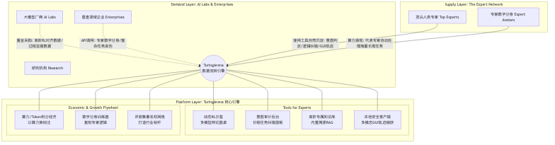

# TuringArena 商业立项书：下一代大模型高阶逻辑数据与意图治理平台

## 一、 项目背景与核心目标 (Background & Objectives)

### 1. 时代背景：2026 年大模型数据生态的“范式转移”
大模型演进已进入“深水区”。随着 o1 等推理模型普及，传统的“人工编写解题过程 (PRM)”的数据标注模式已彻底失效。在代码、数学等具备客观对错的“沙盒领域”，AI 已经能通过自我博弈和强化学习（RL）自主进化，甚至能自主发现系统级漏洞。**数据生产力已经从“人力密集型”转变为“算力驱动的 AI 闭环”。**

### 2. 核心痛点：传统标注平台（如 Scale AI, Surge AI）的“任务下发”模式已失效
既然 AI 能自己产生数据，为什么行业仍极度饥渴？因为在医疗诊断、复杂商业架构、高级法律博弈等**极其复杂的真实世界垂直领域，缺乏“不可自动验证（Unverifiable）”的最终裁判权。**

当前的专家数据生产主要采用“下发任务”模式（如 Scale AI, Surge AI 的现有做法）：平台设计好题目和标注规范，专家按要求完成（如填写 Rubrics 或做双盲测试）。这种“数据血汗工厂”模式虽然可控，但存在致命缺陷：

- **数据缺乏生态效度 (Ecological Validity)**：专家在“做题”与真实工作“做事”时的行为模式存在显著差异。做题往往更直接、更简化，充满“应试感”；而做事则充满了纠结、权衡与多维度思考。
- **缺失中间推理过程**：下发任务往往只能收集到“最终结果”（模型A比模型B好），但专家的搜索、试错、回溯、对比等极其宝贵的过程性纠错行为（Reasoning Trajectories）无法被记录。
- **上下文语境缺失**：真实的专业决策高度依赖当时的工作语境（如数百页的卷宗、连续的上下文探讨），而切片化的任务模式根本无法还原这种深度的语境。
- **边缘长尾场景覆盖不足**：最能体现顶尖专家能力差异的，往往是那些复杂、罕见的 Corner Cases。这些长尾场景很难通过平台人工“设计题目”来覆盖，只能在专家真实的日常工作中自然涌现。
- **单向索取与剥削感（缺乏双向价值）**：在传统模式下，专家纯粹是“卖时间换金钱”，平台和模型大厂拿走了所有的数据红利（训练出更强的模型来替代他们）。这种工具是单向索取的，除了付钱，无法给专家带来任何日常业务上的工具杠杆或行业声誉（劳动成果被打包卖掉，没有署名权）。一旦大厂补贴下降，顶尖专家立刻流失。

### 3. 我们的破局机会 (The Opportunity)
基于上述痛点，2026 年数据标注行业的破局点，已经从“如何更高效地发包”转变为“**如何构建一个让专家离不开的高维工作台，在无形中捕获其工作副产品**”。

TuringArena 的核心机会在于**“范式降维打击”**：
1. **数据维度的升维**：别人在花钱买专家的“最终答案”（结果），我们通过无感采集捕获专家真实的“纠结、检索、对比、回溯”全过程（意图与逻辑轨迹）。
2. **商业模式的降维**：别人在做单向索取的“外包平台”，我们在做双向赋能的“SaaS 工作台 + 专家经济”。我们用极致的 AI 调试工具满足专家的日常业务刚需，**用“工具价值”白嫖到了市面上花钱都买不到的“极品工作数据”。**
3. **产能上限的突破**：传统模式的产能受限于人类物理时间，而我们通过沉淀数据训练“专家数字分身”，让分身在平台自动接单，实现了数据生产从“纯人力”向“AI 代工（Agentic Workflow）”的跨越。

---

## 二、 项目目标与愿景 (Objectives & Vision)

**核心愿景**：构建全球最大的“高阶虚拟专家算力网络”，成为下一代 AGI 训练的“数据引擎”。

**核心目标（结合平台功能落地）**：
1. **打造专家级“AI 协同工作台”（以工具换数据）**：
   - 目标：通过提供“多模型圆桌沙盒”、“内置知识库 (RAG)”等极致的 AI 调试工具，让专家在处理真实复杂业务（如医疗会诊、架构设计）时，离不开我们的平台。
   - 结果：在专家真实办公的过程中，**无感采集**其包含“搜索、试错、回溯、对比”的完整决策过程轨迹数据。
2. **构建高维“意图审计与裁判系统”（沉淀价值标尺）**：
   - 目标：针对多 AI 智能体（Agents）自主执行的长程任务，提供可视化的高维审查界面。
   - 结果：让专家从“做题家”升级为“大法官”，在模型博弈中给出一锤定音的判决，为大模型强化学习（RL）提供最稀缺的**“不可自动验证领域”的价值对齐信号与安全护栏数据**。
3. **实现从“人类脑力”到“数字分身”的算力跃迁（打破产能瓶颈）**：
   - 目标：利用沉淀的高质量微观推理轨迹与多模态操作数据，为每一位入驻专家训练专属的“数字分身 (Expert Avatar)”。
   - 结果：让分身代表专家在平台上自动处理海量长尾发包任务，实现平台数据生产力从“纯人工”向“人机协同/AI 代工”的指数级跨越，并为专家创造真实的“睡后收入”。

**关键设计原则**：
- **真实优先**：数据必须来源于专家的真实日常工作（Doing Real Work），而非为了平台设计的模拟练习（Doing Exercises）。
- **无感采集**：将数据采集深度嵌入工具的工作流中，绝不增加专家额外的打标负担。
- **跨行业复用**：打造通用的底层意图审计与沙盒架构，通过“行业专属工作台模板”（如医疗工作台、法律工作台）实现垂直领域的快速横向扩展。
- **双向价值**：平台必须首先为专家提供极强的“工具价值”与“算力杠杆”，而不仅仅是单向地向专家索取数据。

---

## 二、 核心业务逻辑三问 (The 3 Key Questions)

### Q1：专家为什么来用这个产品？（核心 Sharp 点是什么？）
**核心 Sharp 点：专家不是来“做苦力打工”的，而是来“为自己加杠杆”并“建立行业声誉”的。我们用“工具价值+社区杠杆”换取“极品数据”（Utility-to-Data Flywheel）。**

具体驱动力与激励体系（Growth Flywheel）包括：
1. **第一级激励：解决复杂业务的免费超级工具（Tool Value）**。TuringArena 提供了一个比市面上任何现成 AI 都好用的**多模态沙盒工作台**。专家日常处理长卷宗、复杂架构设计时，能在这里免费拉起多个顶级模型进行“圆桌辩论”，并挂载专属知识库。工具本身就是留住他们的第一道护城河。
2. **第二级激励：Token 算力经济与任务变现（Economic Value）**。专家在工作台解决自身问题会消耗算力积分。算力耗尽后，他们可以在平台的“任务大厅”承接大厂发布的**高薪高阶评测任务**赚取积分。赚取的积分既可以提现（直接变现），也可以兑换更高级的模型 API 额度或专属算力，形成“白嫖算力 $\rightarrow$ 接单赚钱 $\rightarrow$ 持续使用”的闭环。
3. **第三级激励：打造“AI 时代的 GitHub”极客社区与署名权（Community & Social Value）**。这是平台最核心的网络效应。正如顶尖程序员在 GitHub 上通过开源项目证明自己一样，专家在 TuringArena 上构建的高质量难题集（Frontier Benchmarks）、精妙的 Prompt 或纠错逻辑，都可以选择“开源”并永久带有个人署名（Authorship）。
   - **建立同行声誉**：这不仅是 AI 时代的“学术/职业名片”，更能在平台上形成一个汇聚全球最聪明大脑的“极客社区”。
   - **知识的 Fork 与迭代**：专家可以互相查看、点赞（Star）和“Fork”别人的优秀沙盒配置或知识库结构，在社区内探讨最前沿的意图对齐边界，获得极大的职业认同感和归属感。
4. **终极激励：训练专属数字分身的“睡后收入”（Leverage Value）**。专家在平台上的每一次高阶评测、沙盒构建和逻辑纠错，都在潜移默化地训练一个“懂他思考风格”的专属数字分身。分身不仅能作为日常超级助理草拟答案（效率复利），更能在专家授权下，**代表专家在平台自动接单处理海量长尾任务，实现产能突破与真正的睡后收入**。

### Q2：平台收集什么样的真实数据？
我们不收集简单的“对话问答”，而是收集大模型迈向 AGI 最稀缺的**“隐性决策逻辑与意图标尺”**。传统平台只能收集到“显性结果（最终答案）”，而 TuringArena 致力于捕获专家在真实工作流中无意识流露的“隐性决策逻辑 (Implicit Reasoning Trajectories)”，主要包括：

1. **高阶裁判的“最终价值标尺 (Reward Signals)”**：在多个 AI 互相博弈、谁也无法说服谁的复杂难题上，专家拍板定案的“一锤定音”判定，这是大模型 RL 最核心的奖励信号。
2. **“试错与反悔”轨迹 (Trial & Backtracking)**：专家并非一开始就全知全能。他们在工作台中“写了一半删掉重写”、“让模型生成后觉得不对，重新修改 Prompt”、“推翻之前的假设”的过程。这种“自我否定与重构”的轨迹，是教会模型如何进行“自我反思 (Self-Correction)”的最佳教材。
3. **“寻证与对比”轨迹 (Evidence-seeking & Comparison)**：面对复杂问题，专家是如何在知识库中搜索的？他们使用了哪些关键词？他们如何在多份互相矛盾的文档中交叉比对并提取真相？这种过程数据比最终结果更有价值。
4. **对“无意识错误”的干预轨迹 (Intervention on Edge Cases)**：当 AI 模型发生微小的逻辑偏移、幻觉，或触碰了极度隐蔽的安全/伦理护栏时，专家是如何敏锐地发现并进行强制干预（截断、扣分、重定向）的。
5. **多模态系统级操作数据 (GUI Trajectories)**：专家在电脑上操作专业软件（如 CAD、医疗影像系统、复杂网页后台）的真实键鼠点击和屏幕流轨迹，用于教导具备 Computer Use 能力的 AI Agent。

### Q3：通过什么样的产品方案来收集这些数据？
我们通过颠覆性的功能模块，让数据采集“隐形化”：
1. **动态 RL 沙盒（多模型圆桌）**：不再是“文本对对碰”，而是构建微型语义沙盒。专家设定 AI 扮演患者、挑刺者、被测模型，自己作为大法官发号施令，平台自动记录多边博弈与裁判过程。
2. **NotebookLM 级的专属知识库 (Built-in RAG)**：让专家上传海量私密资料，平台不仅打破专家的认知过载，更在后台记录专家的“资料检索溯源路径”，沉淀为极高质量的私有语料。
3. **本地安全客户端与端点接管 (Computer Use Tracker)**：提供类似 OpenClaw 的本地客户端，在授权模式下静默录制专家处理高难度任务时的完整电脑端多模态 GUI 交互轨迹。

---

## 三、 平台生态架构与人群画像 (Platform Architecture & Personas)

### 1. 人群画像分析

*   **供给端（C 端：行业顶尖专家）**
    *   **身份特征**：三甲医院主任医师、红圈所合伙人级律师、资深算法架构师、金融量化研究员等。
    *   **痛点/需求**：时薪极高（数百至数千元），极度痛恨机械性的填表工作；面临 AI 替代焦虑，渴望在 AI 时代确立自身不可替代的价值；希望拥有“数字分身”以突破个人时间瓶颈。
*   **需求端（B 端：AI 厂商与企业客户）**
    *   **身份特征**：基础大模型厂商（如 OpenAI, 字节跳动）、垂直领域 AI 企业（如医疗大模型公司）、需要自动化处理长尾任务的传统大企业。
    *   **痛点/需求**：模型能力在专业领域触顶，极度渴求“不可自动验证”领域的优质奖励信号数据；需要海量安全与价值对齐（RLHF/RLAIF）的高质量干预数据；需要采购真实专家的数字分身算力。

### 2. 产品与业务架构图 (Product Architecture)



```mermaid
graph TD
    subgraph 需求层 (Demand Layer: AI Labs & Enterprises)
        B1[大模型厂商 AI Labs]
        B2[垂直领域企业 Enterprises]
        B3[研究机构 Research]
        B1 -.->|重金采购: 高阶RL对齐数据/过程监督数据| P_Core
        B2 -.->|API调用: 专家数字分身/复杂任务发包| P_Core
    end

    subgraph 平台层 (Platform Layer: TuringArena 核心引擎)
        P_Core((TuringArena<br/>数据流转引擎))
        
        subgraph 核心产品矩阵 (Tools for Experts)
            P1[动态RL沙盒<br/>多模型辩论圆桌]
            P2[意图审计后台<br/>长程任务纠错面板]
            P3[高阶专属知识库<br/>内置溯源RAG]
            P4[本地安全客户端<br/>多模态GUI轨迹捕获]
        end
        
        subgraph 价值流转机制 (Economic & Growth Flywheel)
            V1[算力/Token积分经济<br/>以算力换标注]
            V2[数字分身训练器<br/>复刻专家逻辑]
            V3[评测集署名权网络<br/>打造行业标杆]
        end
        
        P_Core --- P1 & P2 & P3 & P4
        P_Core --- V1 & V2 & V3
    end

    subgraph 供给层 (Supply Layer: The Expert Network)
        C1[顶尖人类专家 Top Experts]
        C2[专家数字分身 Expert Avatars]
        C1 -->|使用工具自然沉淀: 意图判定/逻辑纠错/GUI轨迹| P_Core
        C2 -->|算力涌现: 代表专家自动处理海量长尾任务| P_Core
    end
```

---

## 四、 商业闭环与演进路线 (Business Model & Roadmap)

### 1. 商业模式 (Revenue Streams)
1. **企业级数据交付 (B2B Data Delivery)**：平台最核心的现金流。打包出售高难度的 RL 奖励信号、红蓝对抗轨迹、安全护栏干预数据包，由于技术与专家壁垒极高，客单价远超传统数据标注平台。
2. **专家网络 API 与分身调用抽成**：B 端客户通过 API 直接向认证专家或其“数字分身”发起定向咨询或复杂任务，平台抽取交易佣金。
3. **SaaS 工具订阅 (SaaS Subscription)**：针对拥有内部标注团队或保密要求极高的 AI 公司，提供 TuringArena 系统的私有化部署版本。

### 2. 演进路线规划 (Roadmap)
*   **Phase 1：MVP 与“工具换数据”冷启动**
    *   完成“多模型圆桌 + 本地 RAG 知识库”核心工具链开发。
    *   定向邀请首批垂直领域（如医疗、法律、编程）顶尖专家免费入驻，跑通“专家使用工具解决日常业务 $\rightarrow$ 平台沉淀高阶逻辑数据”的核心飞轮。
*   **Phase 2：商业化闭环与经济系统运转**
    *   引入 B 端定制化评测任务，跑通“专家白嫖算力 $\rightarrow$ 算力耗尽接单赚积分 $\rightarrow$ 积分提现/兑换权益”的 Token 经济闭环。
    *   完成首批高质量企业级数据包的交付。
*   **Phase 3：算力网络跃迁（The Ultimate Vision）**
    *   全面上线“GUI 轨迹采集客户端”与“专家数字分身”功能。
    *   实现平台算力由“纯人类时间”向“人类监督 + 分身自动执行”的指数级跨越，成为全球最大的高阶 AI 算力网络。
